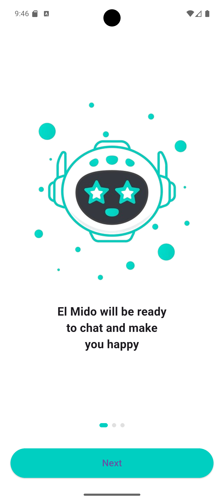
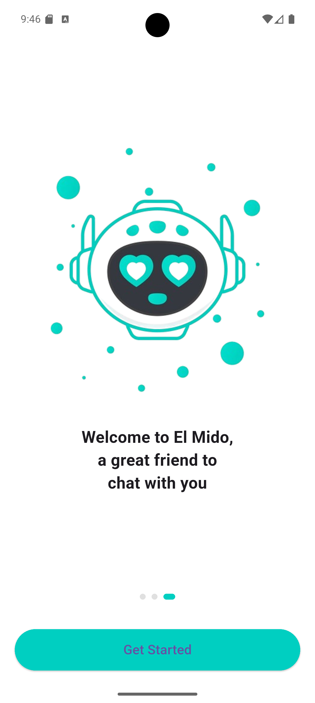

<div align="center">

# 🤖 AI Chatbot

<p align="center">
  
</p>

### An Intelligent Chat Application Powered by AI

[](https://flutter.dev)
[](https://dart.dev)
[](https://ai.google.dev)
[](LICENSE)

</div>

---

## 📱 Screenshots

<div align="center">
  
  
  
</div>

---

## ✨ Features

### 🎯 Core Features
- 💬 **Smart Conversations** - Natural conversations powered by Google Gemini AI
- 🎨 **Beautiful UI** - Modern and user-friendly design
- 🌙 **Dark Mode** - Full support for light and dark themes
- � **Multi-language** - Support for Arabic and English
- 📸 **Image Analysis** - Upload and analyze images
- 🔐 **Biometric Authentication** - Secure app with fingerprint or Face ID

### 🛠️ Technical Features
- ⚡ **High Performance** - Fast and smooth response
- 💾 **Save Conversations** - Automatic saving of all conversations
- 🎭 **Multiple Personalities** - Choose from 7 different robot characters
- 🔄 **Auto Sync** - Save settings and preferences
- 📱 **Cross-Platform** - Works on Android and iOS

---

## 🚀 Getting Started

### Prerequisites

```bash
Flutter SDK: >=3.8.1
Dart SDK: >=3.8.1
```

### Installation

1. **Clone the repository**
```bash
git clone https://github.com/am6888122-lang/chatbot.git
cd chatbot
```

2. **Install dependencies**
```bash
flutter pub get
```

3. **Setup Google Gemini API**
   - Get your API Key from [Google AI Studio](https://makersuite.google.com/app/apikey)
   - Add the key in settings file

4. **Run the app**
```bash
flutter run
```

---

## 📦 Packages Used

| Package | Description |
|---------|-------------|
| `google_generative_ai` | Integration with Google Gemini AI |
| `flutter_markdown` | Display text in Markdown format |
| `image_picker` | Pick images from gallery or camera |
| `local_auth` | Biometric authentication |
| `shared_preferences` | Local data storage |
| `http` | Network requests |
| `intl` | Multi-language support |

---

## 🏗️ Project Structure

```
lib/
├── core/              # Core files
│   ├── theme/        # Theme settings
│   └── utils/        # Helper utilities
├── features/         # App features
│   ├── chat/        # Chat screen
│   ├── settings/    # Settings screen
│   └── auth/        # Authentication
├── l10n/            # Localization files
└── main.dart        # Entry point
```

---

## 🎨 Themes

The app supports multiple themes:
- 🌞 Light Mode
- 🌙 Dark Mode
- 🎨 Customizable Colors

---

## 🌍 Supported Languages

- 🇸🇦 Arabic
- 🇬🇧 English

---

## 🤝 Contributing

Contributions are always welcome! If you'd like to contribute:

1. Fork the project
2. Create your feature branch (`git checkout -b feature/AmazingFeature`)
3. Commit your changes (`git commit -m 'Add some AmazingFeature'`)
4. Push to the branch (`git push origin feature/AmazingFeature`)
5. Open a Pull Request

---

## 📝 License

This project is licensed under the MIT License - see the [LICENSE](LICENSE) file for details.

---

## 👨‍💻 Developer

**Ahmed**

- GitHub: [@am6888122-lang](https://github.com/am6888122-lang)
- Repository: [chatbot](https://github.com/am6888122-lang/chatbot)

---

## 🙏 Acknowledgments

- [Flutter](https://flutter.dev) - The framework
- [Google AI](https://ai.google.dev) - AI engine
- [Material Design](https://material.io) - Design system

---

<div align="center">

### ⭐ If you like this project, don't forget to give it a star!

Made with ❤️ using Flutter

</div>

---

## 📸 How to Add Screenshots

To add screenshots to the project:

1. Create a `screenshots` folder in the project root
2. Take screenshots of the following screens:
   - `chat_screen.png` - Main chat screen
   - `settings_screen.png` - Settings screen
   - `theme_screen.png` - Theme selection screen
3. Place the images in the `screenshots` folder

---

## 🔧 Troubleshooting

### API Key Issue
```dart
// Make sure to add your API Key in the code
final apiKey = 'YOUR_API_KEY_HERE';
```

### Build Issue
```bash
flutter clean
flutter pub get
flutter run
```

---

## 📞 Support

If you encounter any issues or have questions:
- Open an [Issue](https://github.com/am6888122-lang/chatbot/issues)
- Contact via GitHub

---

<div align="center">

**[⬆ Back to Top](#-ai-chatbot)**

</div>
